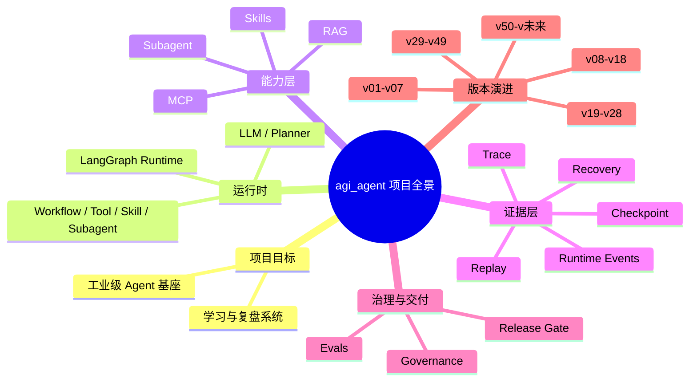

# 项目全景总图

## 结论

当前项目已经不是单一 Agent demo，而是一个持续迭代的工业级 Agent 学习与开发系统。  
Obsidian 里的全景整理目标，是把“版本、文档、代码、阶段、缺口、路线”放进统一导航体系。

## 全景结构

## 导航入口

- [[版本管理导航]]
- [[文档管理导航]]
- [[代码追踪导航]]
- [[当前学习驾驶舱]]
- [[全项目学习路径]]

## 关联

- [[项目最终目标]]
- [[项目当前阶段]]
- [[版本演进总图]]
