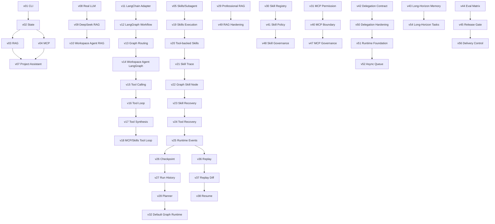

# 版本关系图

## 结论

版本之间不是简单的线性编号关系，而是“能力前置关系”和“阶段收束关系”。

## 全局关系图



## 当前最重要的关系链

```text
v42
-> v50
-> v51
-> v52
-> v53-v56
```

## 关键判断

- `v42 -> v50 -> v51` 是当前多 Agent 主线
- `v25 -> v38` 是运行证据与恢复主线
- `v29 / v30 / v31` 分别引出 RAG / Skills / MCP 的治理深化

## 关联

- [[版本总台账]]
- [[阶段分组总览]]
- [[当前版本链路]]
