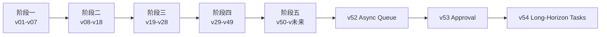

# 阶段分组总览

## 结论

版本整理不应该只按 `v01 -> v51` 平铺，更应该按“项目能力阶段”理解版本关系。

## 阶段导航

- [[阶段一-基础闭环-v01-v07]]
- [[阶段二-真实LLM与LangGraph-v08-v18]]
- [[阶段三-Skills与运行证据-v19-v28]]
- [[阶段四-治理与专业能力-v29-v49]]
- [[阶段五-多Agent运行时-v50-v未来]]
- [[版本关系图]]

## 当前关键链路

```text
阶段一：最小闭环
-> 阶段二：真实 LLM 与图执行
-> 阶段三：运行证据与恢复
-> 阶段四：治理与专业能力
-> 阶段五：多 Agent runtime
```

## 关系图



## 关联

- [[版本总台账]]
- [[版本演进总图]]
