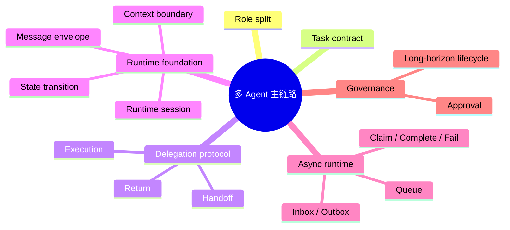

# 多Agent主链路

## 结论

当前多 Agent 主线已经从“谁做什么”推进到“如何正式运行”，但还没有进入异步调度和长期协作阶段。

## 当前演进链

```text
Subagent role split
-> Task contract
-> Delegation record
-> Handoff / Return / Execution
-> Runtime session / Message / Transition
-> Async queue / Inbox / Claim
-> Approval / Long-horizon lifecycle
```

## 思维导图



## 已完成阶段

- `v42`：task delegation and subagent contract
- `v50`：delegation hardening
- `v51`：real multi-agent runtime foundation

## 下一步

- `v52`：async delegation queue and agent inbox

## 当前关键对象

- [[runtime-session]]
- [[message-envelope]]
- [[state-transition]]
- [[context-boundary]]

## 当前代码入口

- [subagent/team.py](../../subagent/team.py)
- [agent/tools.py](../../agent/tools.py)
- [integrations/langgraph_workflow.py](../../integrations/langgraph_workflow.py)

## 关联

- [[v50-委派协议硬化-理解版]]
- [[v51-多Agent运行时基础-理解版]]
- [[v52-异步委派队列计划]]
