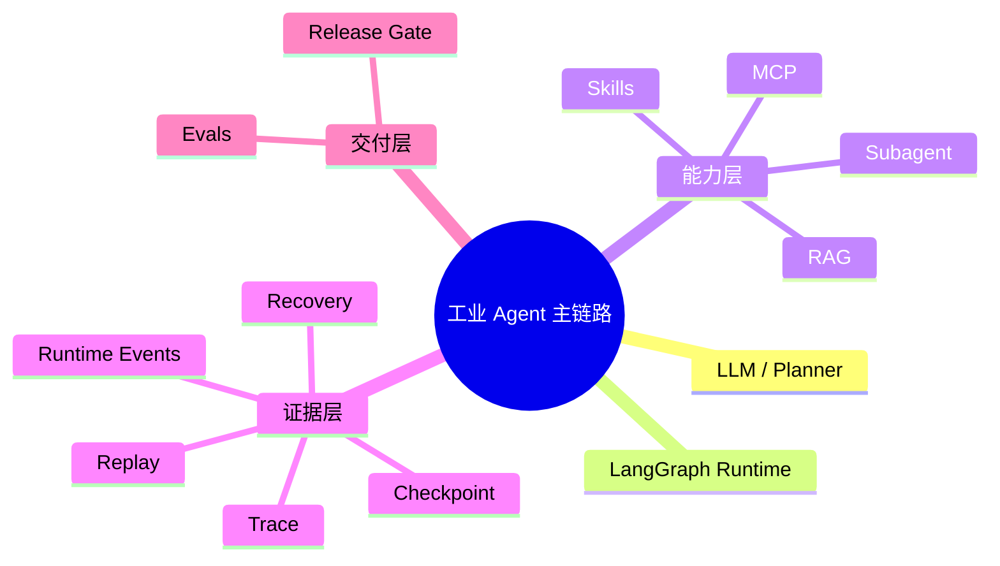
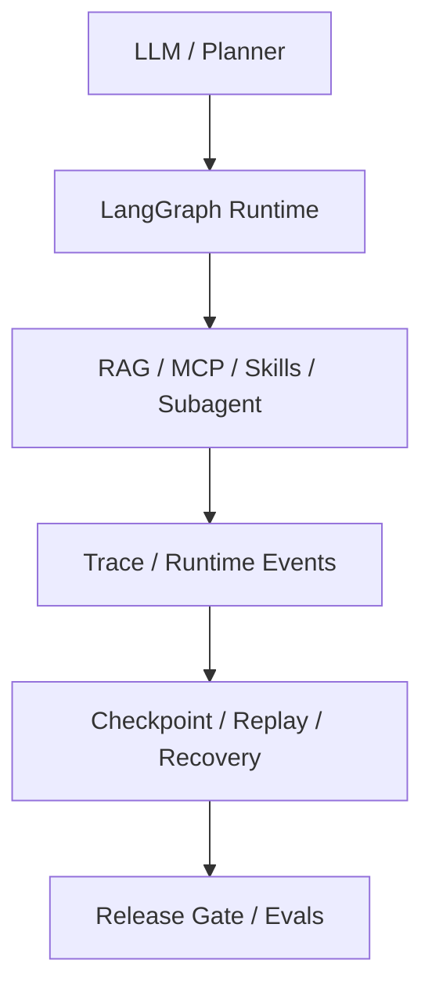

# 工业Agent主链路

## 结论

本项目当前的工业 Agent 主链路已经成型，核心不是单一模型调用，而是“运行时 + 能力层 + 证据层 + 交付层”的整体工程链路。

## 链路总图

```text
LLM / Planner
-> LangGraph Runtime
-> RAG / MCP / Skills / Subagent
-> Trace / Runtime Events
-> Checkpoint / Replay / Recovery
-> Release Gate / Evals
```

## 思维导图



## 结构图



## 分段说明

### 1. 输入与路由

- 用户输入进入 [agent/core.py](../../agent/core.py)
- router / planner 决定 direct answer、tool、workflow、skill、subagent 等路径

### 2. 执行器

- 默认主执行器已经是 LangGraph
- classic runtime 作为兼容和对照路径保留

### 3. 能力层

- RAG：本地检索与 backend hardening
- MCP：执行边界、权限、治理
- Skills：registry、policy、versioning
- Subagent：delegation protocol 和 runtime foundation

### 4. 证据层

- trace
- runtime events
- checkpoint
- replay
- replay diff
- recovery

### 5. 交付层

- tests
- evals
- release gate
- version docs

## 当前代码入口

- [agent/core.py](../../agent/core.py)
- [agent/router.py](../../agent/router.py)
- [integrations/langgraph_workflow.py](../../integrations/langgraph_workflow.py)

## 当前边界

- 多 Agent 还不是 async runtime
- 审批与长任务仍未进入主链

## 关联

- [[多Agent主链路]]
- [[agent模块地图]]
- [[subagent模块地图]]
