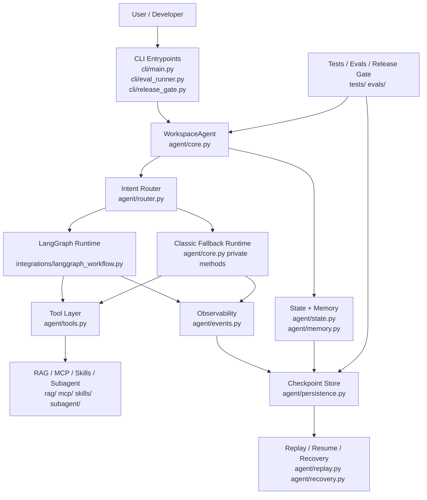

# 系统执行总图

## 结论

当前项目不是“单个 while 循环 + 几个工具函数”的简单 Agent，而是一个以 `WorkspaceAgent` 为中心、以 LangGraph 为默认执行器、以 trace/checkpoint/replay/release gate 为工程闭环的工业级学习项目。

## 分层架构图

## 工程判断

- 默认执行器是 LangGraph，不是 classic runtime。
- classic runtime 仍然保留，用作显式回退和教学对照。
- 工具层没有直接暴露给 CLI，而是统一经过 `WorkspaceAgent` 编排。
- 工程闭环不止“回答用户问题”，还包括运行证据、回放、恢复和发布门禁。

## 关键代码

- [cli/main.py](../../cli/main.py)
- [agent/core.py](../../agent/core.py)
- [agent/router.py](../../agent/router.py)
- [integrations/langgraph_workflow.py](../../integrations/langgraph_workflow.py)
