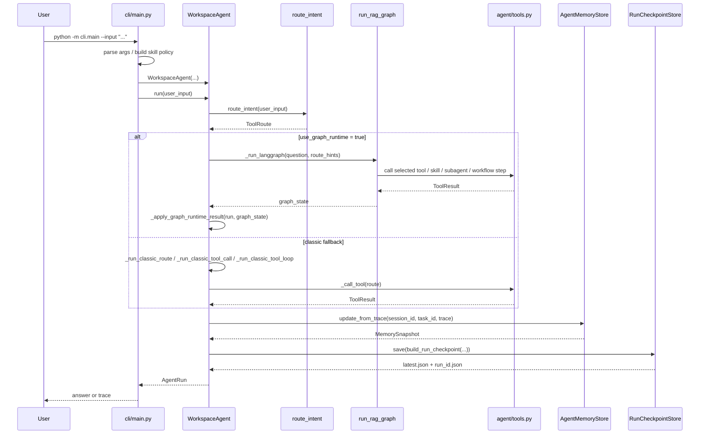

# CLI 到 Runtime 时序图

## 结论

用户输入不是直接打到工具层，而是先进入 CLI 参数解析，再构造 `WorkspaceAgent`，然后通过 `run()` 进入路由、图执行、结果回填、trace 持久化这条主链路。

## 主执行时序

## 相关函数

- 入口构造：[main()](../../cli/main.py)
- 单次执行：[WorkspaceAgent.run()](../../agent/core.py)
- 图执行封装：[WorkspaceAgent._run_langgraph()](../../agent/core.py)
- 持久化：[WorkspaceAgent._persist_run()](../../agent/core.py)

## 学习重点

- CLI 负责参数、入口和展示，不负责编排逻辑。
- `WorkspaceAgent.run()` 是当前项目最重要的 orchestration 函数。
- LangGraph 返回的是 `graph_state`，不是直接面向用户的最终对象；`WorkspaceAgent` 还会做一次回填和标准化。
