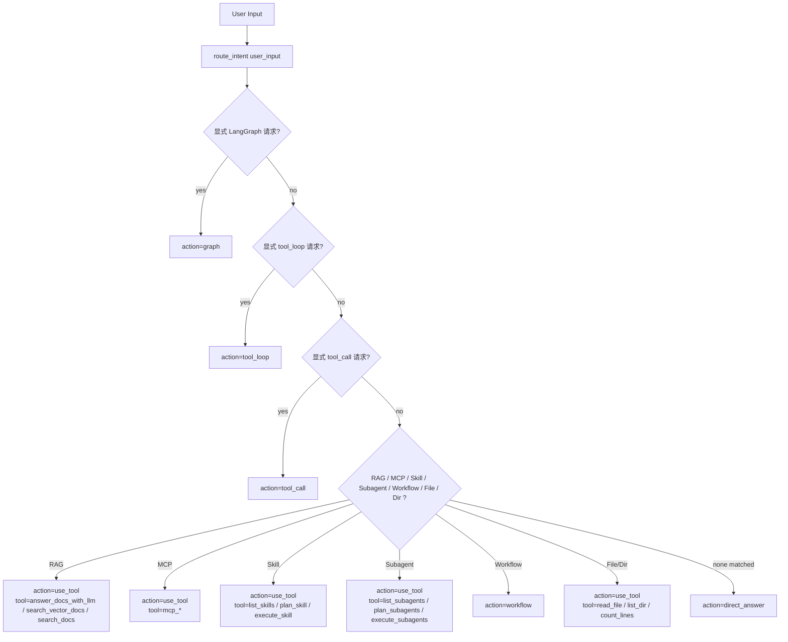
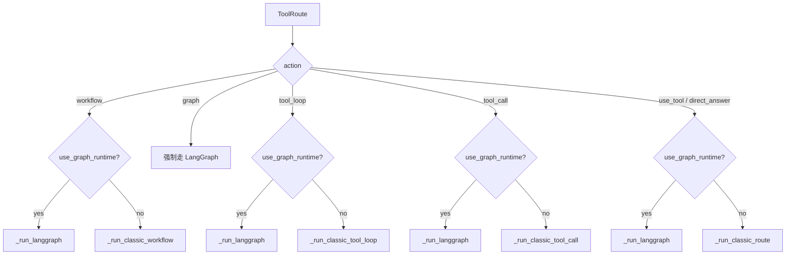

# 路由与函数决策流

## 结论

当前项目的第一层决策器是规则路由器 `route_intent()`，它先把请求分流到 `graph / tool_loop / tool_call / use_tool / workflow / direct_answer` 等大类，再由 `WorkspaceAgent` 决定是否交给 LangGraph 或 classic fallback。

## 路由决策流程

## Runtime 决策流

## 关键函数关系

- 第一层意图识别：`agent/router.py`
- 第二层主编排：`WorkspaceAgent.run()`
- 第三层分支执行：
  - `_run_langgraph()`
  - `_run_classic_route()`
  - `_run_classic_workflow()`
  - `_run_classic_tool_call()`
  - `_run_classic_tool_loop()`

## 工程判断

- 这是“双层决策”，不是单层路由。
- 第一层负责“这是什么类型的任务”，第二层负责“用 graph 还是 classic 执行”。
- 这种设计便于后续把规则路由替换成模型路由，但不破坏主运行面。
