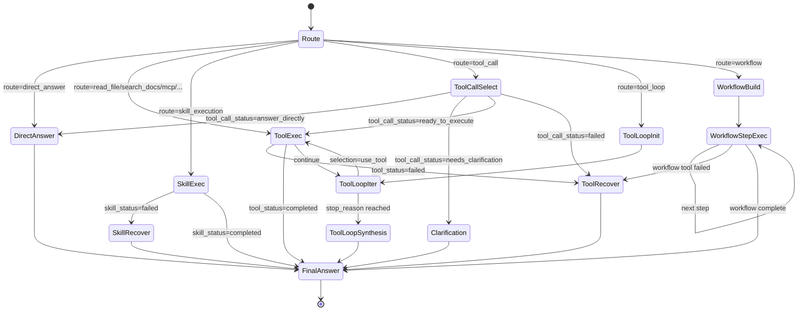

# LangGraph 状态机

## 结论

LangGraph 不是只用来“调用一个工具”，而是当前项目默认主执行器。它承载了普通工具执行、tool calling、tool loop、workflow、skill 恢复和部分 subagent runtime 证据回传。

## Graph 状态字段重点

- `question`
- `route`
- `selected_tool`
- `tool_input`
- `tool_output`
- `tool_status`
- `skill_run`
- `tool_call_selection`
- `tool_loop_result`
- `workflow_plan`
- `recovery_plan`
- `answer`
- `steps`

对应代码：

- [RAGGraphState](../../integrations/langgraph_workflow.py)

## 状态机图

## 代码视角

- graph 入口：`build_rag_graph()` / `run_rag_graph()`
- route node：在 graph 内做第二轮 route/plan
- call_tool / call_skill：执行节点
- recover_tool_failure / recover_skill_failure：失败恢复节点
- tool loop：`initialize_tool_loop()` / `run_tool_loop_iteration()`
- workflow：`build_workflow()` 及后续执行节点

## 工程判断

- `RAGGraphState` 已经不只是 RAG state，本质上是项目 runtime state。
- 现在这张图最值得学习的是“一个 graph 如何承载多种执行形态”，而不是单一 RAG demo。
