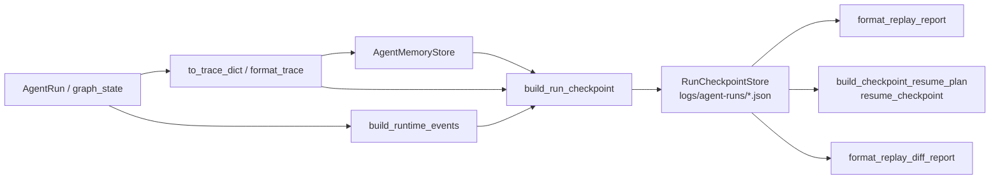
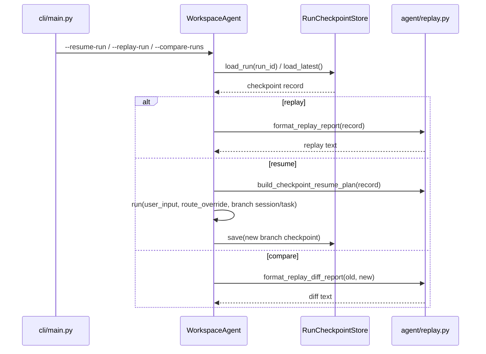

# 运行证据与恢复链路

## 结论

当前项目的工程价值，很大一部分不在“能不能答题”，而在“答题过程能不能留下证据、能不能回放、能不能恢复、能不能比较不同版本行为”。

## 运行证据数据流

## 恢复与比较时序

## 状态与产物

- 运行态对象：
  - `AgentRun`
  - `AgentStep`
  - `RuntimeEvent`
  - `MemorySnapshot`
- 持久化产物：
  - `latest.json`
  - `<run_id>.json`
- 回放类能力：
  - replay
  - compare
  - resume

## 关键代码

- [agent/events.py](../../agent/events.py)
- [agent/persistence.py](../../agent/persistence.py)
- [agent/replay.py](../../agent/replay.py)
- [agent/recovery.py](../../agent/recovery.py)

## 工程判断

- 当前项目已经具备本地可恢复运行时，不只是日志打印。
- `trace -> memory -> checkpoint -> replay/resume/diff` 是一个完整的工程闭环。
