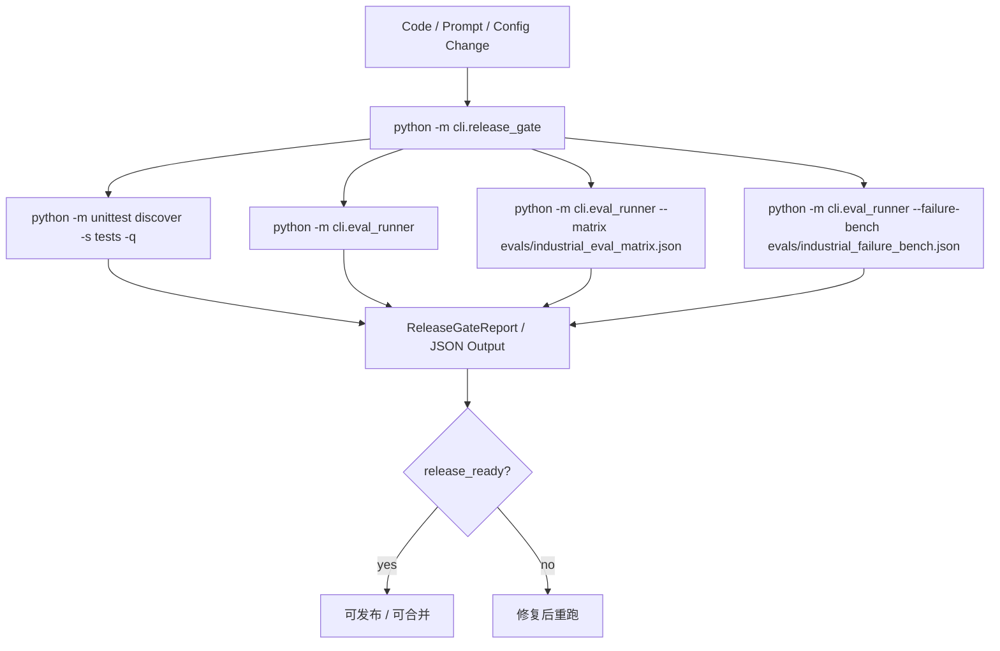

# 质量门禁与 CI-ready 流程

## 结论

当前项目已经具备“CI-ready 的本地质量门禁链路”，但还不是托管平台上的完整 CI/CD pipeline。准确说法应该是：已经有 release gate 编排、测试、回归评估、工业矩阵和 failure bench，可以很容易接到 GitHub Actions / Jenkins / GitLab CI 上。

## 质量门禁流程

## 当前已实现能力

- 单元测试：`tests/`
- 回归评估：`evals/regression_cases.json`
- 工业评估矩阵：`evals/industrial_eval_matrix.json`
- failure bench：`evals/industrial_failure_bench.json`
- 聚合门禁：`evals/release_gate.py`
- CLI 入口：`cli/release_gate.py`

## 当前未画成“已实现”的内容

以下能力暂时不应在图里画成已落地：

- GitHub Actions YAML
- 自动部署
- 制品发布仓库
- 远端观测平台

## 托管 CI 接入建议

如果后续要变成完整 CI/CD，可在现有门禁之上增加：

1. CI Runner 调 `python -m cli.release_gate`
2. 将 `--output` JSON 上传为 artifact
3. 失败时阻止 merge
4. 成功后再接 packaging / release / deployment

## 关键代码

- [cli/eval_runner.py](../../cli/eval_runner.py)
- [evals/runner.py](../../evals/runner.py)
- [evals/release_gate.py](../../evals/release_gate.py)
- [cli/release_gate.py](../../cli/release_gate.py)
