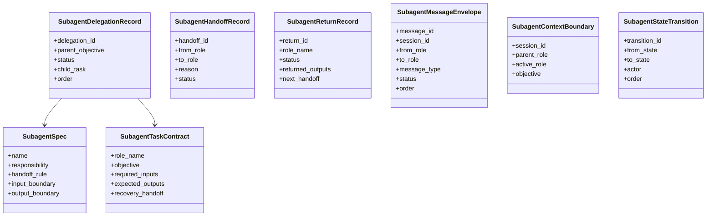
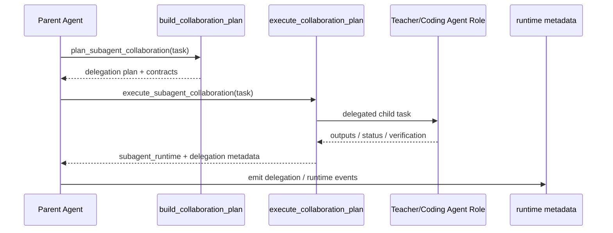

# 子 Agent 委派与消息流

## 结论

当前项目的 subagent 还不是完全异步的多 Agent runtime，但已经具备了专业 runtime foundation：角色定义、任务契约、委派记录、交接记录、返回记录、消息信封、上下文边界和状态迁移。

## 结构模型图

## 委派时序

## 工程判断

- `subagent/team.py` 的重点不是“真的调起第二个模型”，而是先把 runtime contract 设计清楚。
- 这对后续做异步队列、人工审批、消息总线、多 Agent 状态恢复非常关键。

## 关键代码

- [subagent/team.py](../../subagent/team.py)
- [agent/tools.py](../../agent/tools.py)
- [agent/events.py](../../agent/events.py)
