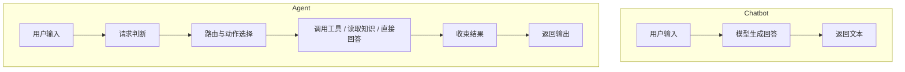
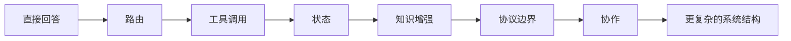

# 第 1 章 什么是 Agent，为什么它不是聊天机器人

当“Agent”这个词越来越频繁地出现在大模型产品、开发框架和技术讨论中时，它也开始变得越来越模糊。很多系统只要接入了大模型、能回答问题、偶尔还能调用工具，就会被直接称为 Agent。表面上看，这种说法似乎没有什么问题，因为这些系统确实比传统聊天程序更灵活，也比固定脚本更“聪明”。但如果从工程角度认真追问下去，问题很快就会出现：一个会生成回答的系统，是否就已经具备了 Agent 的本质？一个会调用工具的程序，是否天然就拥有了 Agent 的结构能力？答案并没有想象中那么简单。

要真正理解 Agent，首先要把它和最容易混淆的对象区分开来。最常见的混淆对象，是聊天机器人。聊天机器人当然可以很强，它可以回答问题、改写文本、总结资料、生成方案，甚至在对话中表现出相当好的上下文连贯性。但聊天机器人的核心目标，仍然是围绕一次输入生成一次回答。它的成功标准，主要是语言输出是否自然、是否相关、是否符合用户期待。换句话说，聊天机器人首先是一种语言响应系统。它可以很有用，却不一定需要承担复杂的执行边界，也不一定需要在系统内部组织持续的行动链路。

Agent 则不同。Agent 的核心不是“会说话”，而是“能围绕目标组织执行”。当用户提出一个请求时，Agent 不只是返回一段文本，而是必须先判断当前任务属于哪一类，决定是否需要调用外部能力，必要时拆分执行路径，并在行动完成后把结果重新收束成统一输出。只要系统开始承担这种“判断路径、组织动作、回收结果”的职责，它就已经离普通聊天程序越来越远。也正是在这个意义上，Agent 更像一个可执行系统，而不只是一个会生成语言的接口。

这也是为什么“模型加工具”并不自动等于 Agent。很多原型系统会在大模型之外挂接若干工具，例如搜索、文件读取、命令执行或数据库查询，然后把这个组合直接称为 Agent。但从工程上看，这样的组合只说明系统具备了更多能力，并不说明这些能力已经被正确组织。如果工具调用只是模型临时触发的一次附属动作，系统没有清晰的路由、没有稳定的状态边界、没有明确的结果收束方式，也没有可靠的验证机制，那么它更像一个功能增强型 LLM 应用，而不是一个成熟的 Agent。

为了把这个区别看得更清楚，可以把 Agent 与另外两类常见系统再做一次对照。第一类是工作流系统。工作流系统强调步骤顺序、节点流转和流程控制，它擅长把一条事先设计好的链路稳定执行下去。第二类是一般意义上的 LLM 应用，它强调围绕某个具体任务利用模型能力提高交互效果，例如问答、摘要、改写、分类或检索增强回答。Agent 与它们并不是完全割裂的，但关注点不同。工作流强调预定义流程，LLM 应用强调模型输出，而 Agent 关心的是系统如何根据当前任务状态在不同路径之间做决策，并把感知、判断、行动和反馈组织成一条可以持续扩展的执行链。

从这个角度说，Agent 至少包含四个最关键的特征。第一，它必须有目标导向，而不是只对输入做被动反应。第二，它必须能够做决策，也就是在不同执行路径之间进行选择，而不是永远走同一条固定流程。第三，它必须能够调动外部能力，不管这种能力是工具、检索、协议接口还是其他角色。第四，它必须能够把行动结果重新纳入系统自身的后续处理，不让每一次动作都变成彼此孤立的临时响应。只有当这四个特征开始稳定地进入同一个系统，Agent 才真正具备了工程意义上的轮廓。

这也是为什么工业级 Agent 不能只从模型能力出发来理解。模型当然重要，因为它影响系统的理解、规划、归纳和交互质量。但如果只盯着模型，往往会忽略一个更决定系统成败的事实：Agent 的难点主要不在“模型会不会回答”，而在“系统如何保证回答、行动和结构之间保持一致”。一个原型之所以难以长期维护，通常不是因为模型本身太弱，而是因为系统边界太混乱。输入没有被正确分类，工具没有被清楚约束，状态没有被明确记录，错误没有被统一处理，运行过程没有被可靠观察。所有这些问题，本质上都属于系统工程问题，而不是单纯的模型问题。

本书所依托的项目，恰好能够把这个判断落到真实代码和真实演进上。项目最初并不是从宏大的多智能体系统开始，而是先建立一个最小可运行闭环：输入进入系统，路由判断请求意图，主执行器选择调用工具还是直接回答，最后再把结果统一收束。这种起点看似简单，却非常关键，因为它已经把 Agent 和普通聊天程序分开了。系统不再只是“收到一句话，再返回一句话”，而是开始承担路径选择和执行组织的职责。后面章节无论继续进入状态、知识、协议还是协作，这个最初区别都会一直保留下来。

如果把这种区别压缩成一张最小示意图，那么聊天机器人和 Agent 的差别可以先看成下面这样：



这张图并不试图穷尽 Agent 的全部复杂性，但它足以说明一个关键事实：聊天机器人主要关心“回答”，而 Agent 必须关心“回答之前系统如何决定自己该做什么”。

理解 Agent 还有一个容易被忽略的点：Agent 不是一个单一功能名词，而是一种不断扩展的系统结构。系统在最早阶段也许只具备简单路由和工具调用，但只要它已经拥有了清楚的执行边界，它就可以在后续逐步长出新的层次。状态会进入系统，因为单次决策不足以支撑复杂任务；知识会进入系统，因为仅靠模型内部知识无法满足更多问题；能力边界会进入系统，因为能力一多，接入方式就必须更清楚。换句话说，Agent 不是某个瞬间被“定义完成”的，而是在系统边界逐步明确之后不断生长出来的。

这种“逐步长出结构”的过程，也可以画成下面这样：



这张图对应的不是某个单独版本，而是本项目后续整条演进主线：系统先解决“能不能执行”，再逐步解决“如何更稳定地执行、更复杂地执行、可治理地执行”。

对于本项目来说，这种“从回答系统走向执行系统”的转变，并不是抽象说法，而是可以在具体代码入口里看到的。`agent/router.py` 中的 `route_intent()` 代表系统开始先做路由判断，而不是把所有请求直接交给统一回答逻辑；`agent/core.py` 中的 `WorkspaceAgent.run()` 则代表系统开始围绕不同执行分支组织运行过程；`cli/main.py` 则说明，这个系统从入口层就已经不是单纯聊天窗口，而是一个明确的执行入口。这几个入口共同说明，项目从一开始就不是在做“更强的对话”，而是在做“更清楚的执行系统”。

因此，本章最希望建立的，不是一个教科书式的狭义定义，而是一种更适合工程实践的判断方式。当你再看到一个系统被称为 Agent 时，真正值得追问的不是它用了哪个框架、接了多少工具，而是它是否具备以下问题的清晰答案：它如何理解当前请求？如何决定下一步动作？如何组织执行链路？如何把行动结果重新收束回系统？如果这些问题没有被明确回答，那么这个系统即使看起来很复杂，也未必真正进入了 Agent 工程的范畴。

只有在这个概念边界被澄清之后，后续关于结构、状态、知识、协议、协作与治理的讨论才有意义。否则，所有后续章节都会失去共同基础，变成若干孤立能力的堆叠。下一章将顺着本章建立的判断，继续回答另一个更具体的问题：如果 Agent 的本质是围绕目标组织执行，那么一个工业级 Agent 至少应当具备哪些基本结构层次，这些层次为什么必须从一开始就被认真对待。

## 本章代码入口

- `agent/router.py`
  重点看 `ToolRoute` 和 `route_intent()`，理解系统如何把自然语言请求转成可执行判断。
- `agent/core.py`
  重点看 `WorkspaceAgent.run()`，理解系统如何围绕不同执行分支组织一次运行。
- `cli/main.py`
  重点看 `build_parser()` 和 `run_once()`，理解项目的入口为什么已经面向“执行系统”而不是单纯对话。

## 代码版本定位

本章推荐先切换到 `v01` 对应的章节标签：`book-ch01-anchor`。

版本资料索引：

- [章节版本索引](../../version-index.md)
- [v01 正式版本文档](../../../versions/v01_minimal-cli-agent.md)

推荐原因：

- 这个阶段最能直接看出“聊天式回答”与“执行式系统”的最小区别。
- 路由、执行和统一输出已经成形，但还没有被后续复杂能力稀释。

推荐检出命令：

```bash
git checkout book-ch01-anchor
```

切换后优先阅读：

- `cli/main.py`
- `agent/router.py`
- `agent/core.py`

最小验证命令：

```bash
python -m cli.main --help
```

## 本章阅读与验证指引

读完本章后，建议按下面顺序继续验证自己的理解：

1. 先打开 `agent/router.py`，确认项目是否真的先做路由判断，而不是直接生成回答。
2. 再打开 `agent/core.py`，确认系统是否存在统一的运行主线和分支处理逻辑。
3. 最后阅读 [v01 正式版本文档](../../../versions/v01_minimal-cli-agent.md)，把本章的概念判断和项目最早的最小闭环对应起来。

如果你能回答下面三个问题，就说明本章的核心概念已经建立起来：

1. 为什么“会回答问题”不自动等于 Agent？
2. 为什么“模型加几个工具”仍然可能只是增强型 LLM 应用？
3. 为什么系统一旦承担路径判断和动作组织职责，就开始进入 Agent 工程范畴？
