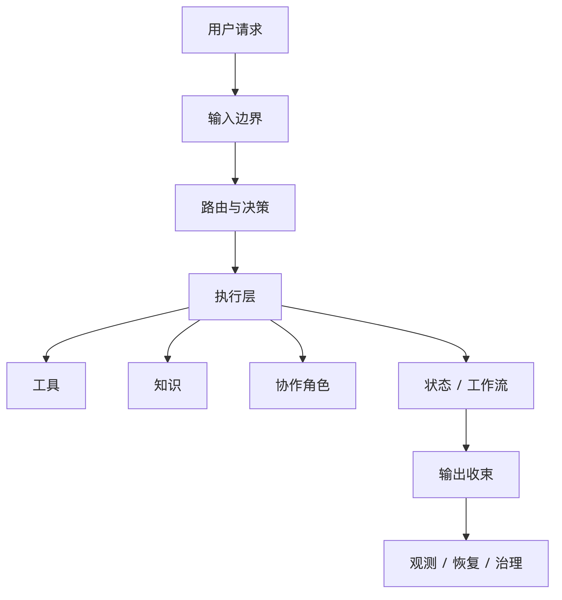
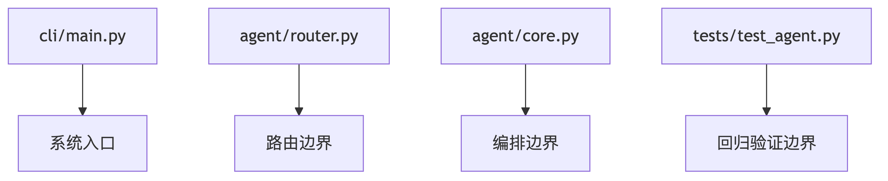

# 第 2 章 工业级 Agent 的基本结构

当 Agent 这个概念的边界被初步澄清之后，随之而来的问题就不再是“它像不像聊天机器人”，而是“它究竟该如何被构建”。这是工程实践里最关键的一步。因为只要系统开始承担目标导向、路径判断、工具调动和结果收束这些职责，它就已经不可能再安全地停留在一个单体函数、几段 prompt 逻辑或若干零散工具调用的层面。一个真正能够持续演进的 Agent，迟早都必须形成自己的结构边界。

所谓工业级 Agent，首先并不意味着它一开始就拥有很多功能。工业级的真正含义，是系统即使在功能尚不复杂时，也已经开始按照长期演进的方式组织自己。它关心的不是“先做出多少能力”，而是“这些能力以后是否还能够继续扩展、替换、验证和治理”。这也是为什么一个能调用模型、能连几个工具的原型，并不自动等于工业级 Agent。原型也许足够聪明，但如果输入边界不清楚、执行链路不清楚、状态承载不清楚、错误处理不清楚，那么它越扩展，后续就越难维护。

要理解工业级 Agent 的基本结构，最简单的方法不是先去记具体模块名称，而是先问一个更本质的问题：一个请求进入系统之后，究竟会经历哪些必要的边界。无论项目规模大小，一个可持续演进的 Agent 至少都要回答以下几件事。第一，输入如何进入系统，谁负责解释当前请求属于什么类型。第二，请求被识别之后，系统如何决定是直接回答、调用工具、读取知识、进入多步执行，还是切换到其他角色。第三，执行过程中产生的中间信息要由谁保存、由谁汇总。第四，最终结果如何统一返回，错误又如何被捕获和观察。只要这些边界没有被明确分开，系统复杂度一上来，所有逻辑都会被迫挤进同一条脆弱的流程里。

也正因为如此，工业级 Agent 的第一原则不是“功能更多”，而是“边界更清楚”。在实践中，这通常会表现为几个反复出现的结构层次。最靠前的是输入与路由层，它决定系统是否能够把自然语言请求转化成可执行判断。之后是执行层，它负责真正调动工具、知识源、协议接口或其他能力角色。再往后是状态与工作流层，当系统开始面对多步任务时，它必须能记录中间状态、维持执行上下文并组织阶段性结果。随着能力继续扩展，还会出现知识增强层、协议与工具边界层、协作层、运行时编排层，以及更后面的可观测性、恢复和治理层。它们并不是彼此独立的附属模块，而是从同一个执行系统中逐步长出的不同维度。

如果把这种结构关系先画成一张整体示意图，那么一个工业级 Agent 的基本层次大致可以理解为：



这张图的意义不在于精确对应每一个实现文件，而在于帮助读者先建立一个整体感觉：Agent 不是一条单线调用，而是一个由多个边界共同支撑的执行系统。

这套结构并不是凭空设计出来的，而是由复杂度逼出来的。一个最小 Agent 也许只需要简单路由和一个工具分支，但只要开始处理多步任务，状态就必须进入系统；只要开始面对超出模型内生知识的问题，知识增强就必须进入系统；只要工具越来越多、接入方式越来越杂，协议边界就必须被标准化；只要系统不再只是单条直线流程，运行时编排和协作层就迟早会出现。结构的增长不是为了追求“看起来专业”，而是为了让系统复杂度始终有稳定的承载位置。

如果进一步把这种增长画成演进过程，那么可以得到一张更接近本项目推进方式的图：


这张图强调的不是版本号，而是复杂度如何一步一步把系统推向更完整的结构层次。

本书依托的项目正是沿着这样的路径演进的。最早的版本先建立输入、路由、工具和输出这条最小执行骨架。随后，状态与工作流进入系统，是因为单次决策已经无法支撑复杂任务。RAG 进入主链路，是因为知识边界必须被显式处理。MCP 与 Skills 逐步进入系统，是因为能力不再适合继续用零散方式挂接。LangGraph 和图式运行时会出现，是因为执行路径已经复杂到需要结构化表达。再往后，可观测性、checkpoint、恢复、权限与 registry 等能力进入系统，则是因为一个长期运行的 Agent 不可能只靠“能跑”来维持稳定。这样的演进过程本身就说明，工业级 Agent 的结构不是一次设计完成的架构图，而是一套随着系统问题逐步暴露而不断成型的工程骨架。

从阅读全书的角度说，本章还有一个更重要的作用：它为后续所有章节提供共同坐标。如果读者没有先建立“Agent 是分层系统”这一认识，那么后面关于状态、RAG、MCP、Subagent、tool loop、LangGraph 甚至恢复与治理的章节，就会被误解成一组平行功能点。实际上，它们并不平行。它们是围绕同一个系统不断补齐边界的不同阶段。状态不是额外功能，而是执行链路从单步走向多步之后的必然结果；RAG 不是可有可无的外挂，而是知识问题进入主链路后的结构性应对；协议与协作也不是“高级玩法”，而是能力复杂化之后对边界和角色分工的正常要求。

因此，本章真正要建立的，不是某一版固定架构图，而是一种结构性认知：工业级 Agent 的关键从来不是把所有能力同时接进来，而是保证系统在每个阶段都能清楚回答“当前边界由谁负责”。只要边界稳定，能力就可以继续扩展；如果边界混乱，任何新增能力都会反过来削弱系统整体稳定性。这也是为什么本书会反复强调“先有结构，再扩展能力”。它不是一句抽象原则，而是 Agent 工程能否持续成立的前提。

在这个前提下，后续章节就有了明确的展开顺序。下一章将从这套结构里最核心、也最早出现的一部分开始，也就是最小 Agent 执行闭环。只有先把输入、路由、执行和输出这条最短主线真正建立起来，后面关于状态、知识、协议和协作的讨论才有可落脚的基础。换句话说，工业级 Agent 的全部复杂度，最终都要重新回到那个最初的问题：系统到底是如何把一次请求组织成一条可解释、可执行、可验证的链路的。

对于本项目来说，这种结构并不是纸面想象，而是能在几个关键入口里直接观察到的。`agent/core.py` 中的 `WorkspaceAgent.run()` 是最重要的主入口，它把一次运行统一收束到同一个执行面上；`agent/router.py` 中的 `ToolRoute` 和 `route_intent()` 体现了路由与决策边界；`cli/main.py` 说明系统入口不仅能处理单轮输入，还已经承载了 replay、resume、memory 和 runtime policy 等更靠近工业化阶段的操作；`tests/test_agent.py` 则说明这些结构边界从一开始就被放进回归验证，而不是等功能变大之后再补测试。

如果把这些代码入口和结构边界的对应关系画出来，它们大致是下面这样：



从这个意义上说，工业级 Agent 的结构感，并不只体现在复杂功能是否存在，更体现在代码是否已经围绕长期演进建立起稳定骨架。即使在项目的早期阶段，这种骨架也已经比“模型输出 + 工具调用”的简单组合走得更远。

## 本章代码入口

- `agent/core.py`
  重点看 `WorkspaceAgent.run()`，理解系统如何把不同执行路径纳入统一主线。
- `agent/router.py`
  重点看 `ToolRoute` 和 `route_intent()`，理解路由边界在整体结构中的位置。
- `cli/main.py`
  重点看运行入口、历史记录、resume、memory 和 runtime policy 参数，理解为什么系统入口已经面向长期运行。
- `tests/test_agent.py`
  重点看路由、workflow、graph runtime 和 direct answer 的测试，理解结构边界如何被持续验证。

## 代码版本定位

本章推荐先切换到 `v04` 对应的章节标签：`book-ch02-anchor`。

推荐原因：

- 到这个阶段，最小闭环、状态、RAG 和 MCP 边界已经先后进入系统。
- 对“工业级 Agent 的基本结构”来说，这个代码状态比更早的单点原型更完整，但又还没有进入后期的大规模运行时扩展。

推荐检出命令：

```bash
git checkout book-ch02-anchor
```

切换后优先阅读：

- `cli/main.py`
- `agent/router.py`
- `agent/core.py`

如果希望按结构增长顺序学习，再按下面的章节标签回看：

- `book-ch01-anchor`
- `book-ch04-anchor`
- `book-ch05-anchor`
- `book-ch02-anchor`

最小验证命令：

```bash
pytest tests/test_agent.py
```

## 本章阅读与验证指引

读完本章后，建议按以下顺序继续阅读：

1. 先看 `agent/core.py`，确认这个项目是否真的存在统一执行面，而不是散乱脚本。
2. 再看 `agent/router.py`，确认路由逻辑如何作为系统前置判断边界。
3. 再看 `cli/main.py`，确认项目入口为什么已经具备接近运行时控制台的形态。
4. 最后回看 `versions/v01_minimal-cli-agent.md` 到 `versions/v04_mcp-local-protocol.md`，把结构层次和版本演进对应起来。

如果你能回答下面三个问题，就说明本章的核心结构已经建立起来：

1. 为什么“功能多”并不等于“结构成熟”？
2. 为什么输入、路由、执行、状态和输出边界必须尽早分开？
3. 为什么可观测性、恢复和治理虽然通常后出现，但在结构上从一开始就应被预留位置？
