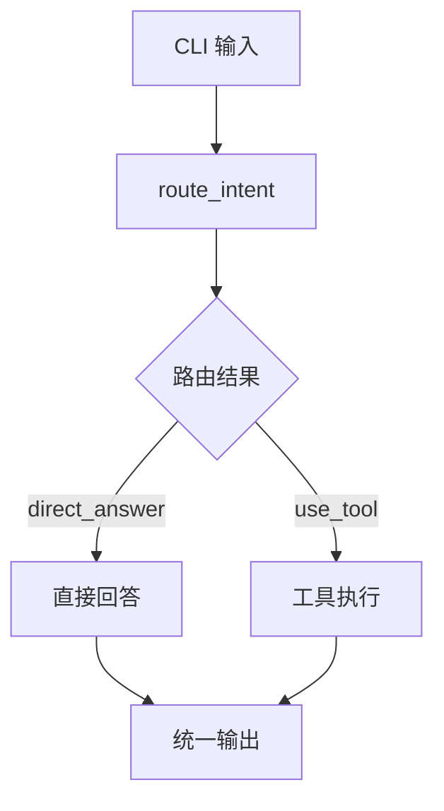
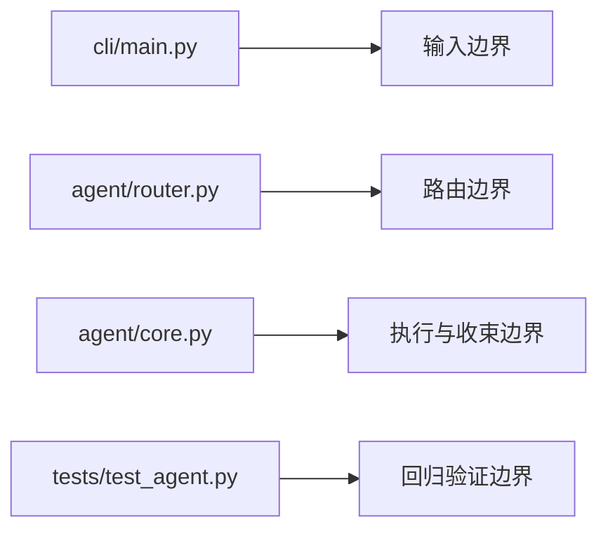

# 第 3 章 最小 Agent 执行闭环

每当人们第一次尝试实现一个 Agent，最容易犯的错误，往往不是能力太少，而是过早追求能力太多。一个看起来很“聪明”的原型，可能一开始就接入模型、挂上几个工具、再拼上一些复杂框架，表面上功能丰富，实际却没有稳定的执行主线。输入从哪里进入系统，系统如何判断动作，工具结果如何回到最终回答，错误发生时又该由哪一层负责处理，这些最基础的问题如果没有先被回答，后面的扩展就很容易变成一组彼此松散的 demo。

这个项目的第一步，恰恰没有从复杂能力开始，而是先追求一个最小闭环。所谓最小闭环，并不意味着做一个“简化版玩具”，而是先建立一条最基本、但必须清楚的执行路径：用户输入进入系统，系统先做路由判断，然后决定是直接回答还是调用工具，最后将结果整理成统一输出。这条路径足够短，却构成了整个 Agent 工程后续一切能力的底座。

在项目早期版本里，这条闭环最重要的价值，不在于它能处理多少复杂场景，而在于它明确了系统最初的分工。输入不是直接丢给某个大函数自由发挥，系统必须先判断当前请求应该走哪条路。这个判断由路由层完成；路由给出动作后，主执行器再决定接下来的执行分支；如果需要工具，工具层负责实际动作；最后再由统一的输出结构把结果收束回来。这样的分层听起来并不华丽，但它把“会回答问题”这件事，转化成了“能做出可执行决策”的系统行为。

也正是在这里，Agent 和普通聊天程序第一次真正拉开差异。聊天程序可以把输入和输出直接连起来，而 Agent 不能这样偷懒。Agent 的关键不只是生成语言，而是要决定行动。只要系统中存在“是直接回答，还是调用工具”这样的分歧路径，它就不再是一个简单的文本生成器，而是一个带有执行边界的程序。最早的路由逻辑虽然很朴素，例如把请求区分成 `use_tool` 或 `direct_answer`，但这一步已经足够重要，因为它意味着系统开始先做工程判断，再做内容生成。

从代码结构上看，这个阶段最值得关注的，不是谁写了多少逻辑，而是谁承担了什么职责。CLI 层负责把请求送进系统，路由逻辑负责把自然语言映射成可执行意图，主执行器负责串联路径、记录步骤、收束结果，测试则负责确认这条闭环在后续迭代中不会被悄悄改坏。一个成熟的 Agent 项目迟早会长出更多层，但在最早的起点上，真正重要的是把这几层的边界先分开。否则，后面一旦继续引入状态、工作流、RAG 或多智能体协作，所有复杂性都会直接压到同一段流程里，维护成本会迅速失控。

如果把这条最小执行主线画出来，它大致可以看成下面这样：



这张图之所以重要，不是因为它复杂，而是因为它定义了后续所有能力都必须回到的最短路径。只要这条路径稳定，系统才能继续生长；一旦这条路径混乱，后面的复杂能力都会失去锚点。

因此，这一阶段的重点并不在于“先做出多少能力”，而在于先把执行骨架搭出来。最小闭环可以被压缩成一句很简单的话：用户输入进来以后，系统必须先判断，再执行，最后返回统一结果。可一旦把这句话真正落实到工程里，许多后续扩展的前提就同时成立了。因为只要有了清楚的输入边界、路由边界、执行边界和输出边界，后面无论增加状态对象、引入工作流、接入知识检索，还是替换更复杂的运行时编排方式，系统都还有稳定的锚点可以继续演化。

如果进一步把“谁负责什么”画成职责分布，那么可以得到下面这张图：



这张图把最小闭环真正的工程价值说得更清楚了：闭环不是一个函数，而是一组职责被明确拆开的边界。

这个阶段的另一个关键点，是测试必须从一开始就跟上。很多项目会把测试留到系统复杂之后再补，但对 Agent 来说，这往往太晚了。因为最小闭环一旦不稳定，后续所有能力都建立在一块不断晃动的底座上。项目中的早期测试价值，并不只是验证某个函数是否返回预期值，而是在验证整条最短执行链有没有断裂。路由是否还能做出正确选择，工具调用链是否还能闭合，最终输出是否还能稳定返回，这些都属于“底座级”的正确性。没有这些护栏，后面每一次新增能力，都会有把最小闭环悄悄破坏掉的风险。

从学习角度说，这一章最应该留下的不是几个接口名，而是一种判断框架：当你面对一个 Agent 原型时，先不要急着问它支持多少工具、是否接入了复杂框架，而应该先问它有没有形成稳定闭环。输入是怎么进入的？中间有没有清楚的路由决策？执行过程是否分层？结果是否统一收束？这些问题看似基础，却决定了一个项目后续是能够持续演化，还是只能停留在一次性演示。

也正因为最小闭环已经建立起来，项目的下一步才自然转向状态与工作流。单次决策可以处理简单请求，却无法稳定支撑多步任务；一旦系统要保存中间结果、拆分步骤、汇总过程，就必须引入新的状态结构和执行计划。换句话说，并不是因为项目“想做工作流”才有后续版本，而是因为最小闭环成功之后，它的边界已经暴露出了新的不足。正是这种“先建立，再暴露限制，再继续扩展”的节奏，构成了整个项目迭代的基本方法。

所以，最小 Agent 闭环真正完成的，并不是一个简易功能，而是一种工程起点。它告诉读者，一个 Agent 项目最先需要的不是花哨能力，而是一条能被解释、能被测试、能被持续扩展的执行主线。后面的章节会不断增加复杂度，但无论系统后来长到多大，所有能力最终都必须重新落回这个起点之上。

下一章将进入状态与工作流，继续追问同一个问题：当单次路由和单次执行已经不够时，系统应当如何引入中间状态、多步计划和可追踪过程，而不把原本清楚的闭环重新变回一团脚本。

## 本章代码入口

- `cli/main.py`
  重点看 `run_once()` 和主入口参数，理解请求是如何进入系统的。
- `agent/router.py`
  重点看 `ToolRoute` 和 `route_intent()`，理解最小路由判断如何定义请求路径。
- `agent/core.py`
  重点看 `WorkspaceAgent.run()`，理解最小闭环如何被统一组织成一次运行。
- `tests/test_agent.py`
  重点看路由、direct answer、read file 和 workflow 起点相关测试，理解最小闭环如何被持续保护。

## 代码版本定位

本章推荐先切换到 `v01` 对应的章节标签：`book-ch03-anchor`。

推荐原因：

- 这个标签对应的代码状态最集中地呈现了最小 Agent 执行闭环。
- 读者可以在最少干扰下观察输入、路由、工具分支和统一输出。

推荐检出命令：

```bash
git checkout book-ch03-anchor
```

切换后优先阅读：

- `cli/main.py`
- `agent/router.py`
- `agent/core.py`

最小验证命令：

```bash
pytest tests/test_agent.py -k route
```

## 本章阅读与验证指引

读完本章后，建议按以下顺序继续验证：

1. 先读 `versions/v01_minimal-cli-agent.md`，明确项目最早解决了什么。
2. 再读 `agent/router.py`，确认请求如何先被分类。
3. 再读 `agent/core.py`，确认一次运行如何被串成统一主线。
4. 最后读 `tests/test_agent.py`，确认最小闭环为什么必须从一开始就被测试覆盖。

如果你能回答下面三个问题，就说明本章的核心已经建立起来：

1. 为什么最小闭环的价值在于“先做通主线”，而不是“先堆功能”？
2. 为什么路由、执行和输出边界必须在最早阶段就拆开？
3. 为什么测试在这里不是附属工作，而是结构护栏的一部分？
