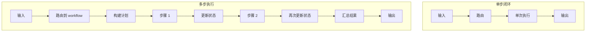
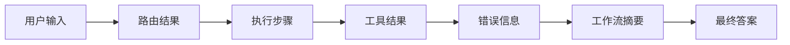
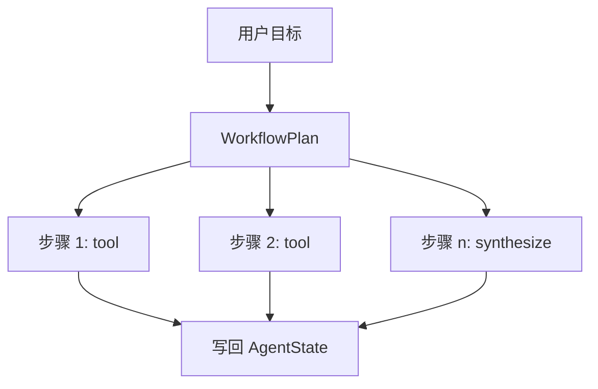

# 第 4 章 状态、工作流与多步执行

最小执行闭环建立之后，系统已经能够完成一类最基础的任务：收到一个请求，做出一次判断，执行一次路径，然后给出结果。对很多演示性质的原型来说，这已经足够让系统“看起来像一个 Agent”。但只要任务稍微复杂一点，这种单次判断、单次执行的结构就会迅速暴露出局限。用户如果不再只是要求“读一个文件”或“回答一个问题”，而是要求系统先做一件事、再做第二件事、最后综合前面的结果，那么原本清楚的最小闭环就会面临新的压力。系统需要记住中间结果，需要知道当前走到哪一步，需要知道下一步应该接着执行什么，还需要在最后把多次执行的结果收束成一个统一答案。

这也是为什么 Agent 一旦从单步任务迈向多步任务，就必须引入状态和工作流结构。这里的“状态”，并不只是程序里临时放几个变量，而是系统对一次运行中间信息的正式承载方式。这里的“工作流”，也不只是把若干步骤顺序写在注释里，而是把一个多步任务拆解成可以被观察、被执行、被汇总的计划结构。只要这两层没有建立起来，多步任务最终仍然会退化成一段越来越长、越来越难维护的脚本流程。

从工程角度看，单步闭环之所以不够，并不是因为它做错了什么，而是因为它本来就只解决了最早阶段的问题。它回答的是：系统收到一个请求之后，如何先判断，再决定调用工具还是直接回答。可一旦请求本身开始包含顺序关系，例如“先读取 README，再统计行数”或者“先查看目录，再决定读哪个文件”，系统就不能再只围绕一次分支判断运行。它必须知道前一步做了什么、前一步的输出是什么、这些输出要不要成为下一步的输入，以及所有步骤完成之后最终要如何汇总。这些问题如果还交给单次路由和单次执行来硬扛，结构迟早会崩掉。

本项目在 `v02` 里引入状态与工作流，正是为了解决这个问题。与 `v01` 相比，这并不是简单多加了几行逻辑，而是系统执行方式发生了第一次真正的结构升级。原本的 Agent 已经可以把用户请求变成路由判断，并把结果导向单次执行路径；现在，它还要能够在一次运行中携带中间状态，并根据用户请求构造出一个顺序计划。这一步意味着系统不再只是“执行一个动作”，而是开始“管理一段过程”。

如果把这种变化压缩成一张图，那么单步执行和多步执行的差异可以先看成下面这样：



这张图最重要的地方，不是步骤数量变多了，而是系统中出现了一个新的中心对象：执行中的状态。只有当系统能够持续携带状态，多步任务才不会变成若干彼此无关的动作。

在本项目里，这一层首先体现在 `agent/state.py`。其中的 `AgentState` 并不是一个抽象概念，而是运行过程中真实存在的数据容器。它记录本次运行的 `run_id`、用户原始输入、路由结果、执行轨迹、工具结果、工具错误、工作流摘要和最终答案。换句话说，它承担的是“把一次运行中的关键事实收集起来”的职责。系统一旦进入多步任务，就不能只靠局部变量临时传递上下文，因为那样很快就会丢失顺序感和历史感。`AgentState` 的出现，意味着中间结果开始成为系统的一等对象，而不是代码里的偶然副产品。

如果把 `AgentState` 的职责再压缩成一张更直观的图，它大致可以看成这样：



这张图说明，状态对象的意义不只是“存东西”，而是把原本容易散落在不同分支中的信息统一纳入同一个运行上下文里。后续无论是 trace、checkpoint、replay 还是恢复能力，本质上都建立在这种“中间信息已被显式保存”的前提之上。

有了状态，还需要计划。否则系统虽然能保存过程，却仍然不知道这个过程应当如何被组织。这就是 `agent/workflow.py` 的作用。这里的 `WorkflowPlan` 和 `WorkflowStep` 把多步任务从自然语言表达转成一组顺序步骤。每个步骤有自己的标题、类型、工具名、工具输入和说明，而整个计划则围绕一个明确目标来组织这些步骤。这样的设计让工作流第一次从“代码里的隐式顺序”变成“系统中的显式结构”。

这里最关键的工程变化，是任务开始先被“规划”为可以执行的顺序结构，再进入实际执行。系统不再只问“这一句话该怎么回”，而是开始问“为了完成这个目标，我需要先做什么、再做什么、最后如何总结”。即便当前项目中的工作流规划仍然是规则驱动的，它也已经足够说明一个重要原则：一旦系统面对多步任务，计划结构必须出现，否则后续每一次扩展都只能继续在单体流程里硬拼。

如果把 `WorkflowPlan` 的角色画成一张最小图示，那么它更像下面这样：



这张图强调的是，计划并不是结果本身，而是把多步执行组织起来的中间结构。它位于用户目标和最终答案之间，承担的是“把目标变成过程”的职责。

对于本项目来说，更值得注意的是：状态与工作流并没有推翻前一章建立起来的最小闭环，反而是站在那个闭环之上继续生长。系统仍然先做路由判断，只不过当请求被识别为 workflow 类型时，主执行器不再直接进入单次工具路径，而是先构建工作流计划，再顺序执行步骤，把结果写回状态，最后统一生成工作流摘要。这说明一个很重要的工程方法：新结构的进入，不应该破坏旧结构，而应该在旧结构已经稳定的前提下扩展新的执行面。只有这样，系统复杂度增长时才不会反向摧毁原有能力。

本项目的 `v02` 版本材料也清楚地说明了这一点。工作流并不是另起炉灶的新系统，而是最小 Agent 闭环上的第一次正式扩展。`agent/core.py` 中的工作流分支体现了主执行器如何接纳多步任务；`agent/state.py` 和 `agent/workflow.py` 体现了中间状态与计划结构如何成为系统的一部分；`tests/test_agent.py` 里的工作流测试，则体现了多步执行从一开始就进入回归验证，而不是靠手工演示维持正确性。这一点非常关键，因为一旦系统拥有了多步执行能力，失败路径、步骤顺序和结果汇总都会比单步路径更容易出错。

从全书后续主线来看，本章的意义还不仅仅是“让系统支持多步任务”。更重要的是，它为后面的许多能力提前准备了容器。RAG 之所以能进入主链路，是因为系统已经能够承载中间知识结果；MCP 和 Skills 之所以能更稳定地接入，是因为工作流可以把不同能力组织成顺序动作；LangGraph 之所以会成为更后面的自然选择，也是因为状态和步骤结构已经让系统开始具备被图式运行时进一步接管的基础。换句话说，状态与工作流并不是一个孤立阶段，而是很多后续结构能力真正开始长出来的节点。

本章最终希望读者建立的判断是：多步执行的难点，不在于“多做几步”，而在于系统是否能把过程显式组织起来。只要过程还是隐式的、临时的、散落在局部变量和 if 分支里，系统复杂度就无法真正被控制。只有当状态成为正式对象、计划成为正式结构、多步执行成为正式路径时，Agent 才真正跨过了从单次动作到过程管理的门槛。

下一章将继续沿着这个门槛向前推进，进入知识增强，讨论当系统不仅要管理过程，还要面对模型知识边界时，RAG 为什么会进入 Agent 的主链路，以及它如何改变执行系统的结构。

## 本章代码入口

- `agent/state.py`
  重点看 `AgentState` 和 `AgentStep`，理解运行中间状态如何被正式承载。
- `agent/workflow.py`
  重点看 `WorkflowPlan`、`WorkflowStep`、`build_workflow_plan()` 和 `build_workflow_summary()`，理解目标如何变成多步计划，以及结果如何被汇总。
- `agent/core.py`
  重点看 workflow 分支，理解主执行器如何在不破坏最小闭环的情况下接纳多步执行。
- `tests/test_agent.py`
  重点看工作流相关测试，理解多步路径如何被回归验证。

## 代码版本定位

本章推荐先切换到 `v02` 对应的主锚点提交：`9aa49a4`。

推荐原因：

- 这是状态对象与工作流结构第一次明确进入主链路的阶段。
- 本章核心概念可以直接与 `AgentState`、`WorkflowPlan` 和 workflow 分支对应起来。

推荐检出命令：

```bash
git checkout 9aa49a4
```

切换后优先阅读：

- `agent/state.py`
- `agent/workflow.py`
- `agent/core.py`

最小验证命令：

```bash
pytest tests/test_agent.py -k workflow
```

## 本章阅读与验证指引

读完本章后，建议按以下顺序继续验证：

1. 先读 `versions/v02_state-workflow.md`，建立版本层面的变化全貌。
2. 再读 `agent/state.py`，确认系统为什么需要显式状态对象。
3. 再读 `agent/workflow.py`，确认计划结构如何把目标变成过程。
4. 最后读 `tests/test_agent.py` 中的 workflow 测试，确认多步执行的正确性是如何被验证的。

如果你能回答下面三个问题，就说明本章的核心已经建立起来：

1. 为什么单步闭环一旦面对复杂任务就会暴露结构性不足？
2. `AgentState` 为什么不是普通变量集合，而是后续很多能力的基础容器？
3. `WorkflowPlan` 为什么代表系统第一次从“执行一个动作”走向“管理一段过程”？
