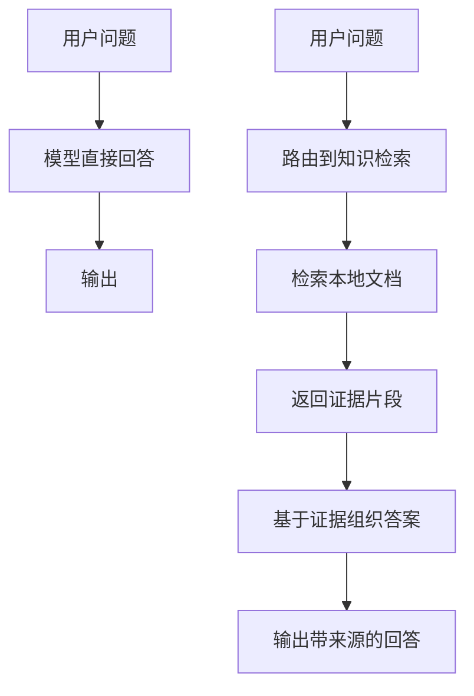
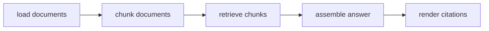
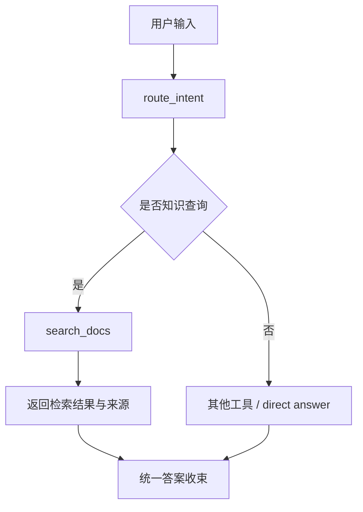

# 第 5 章 知识增强：RAG 如何进入 Agent 主链路

状态与工作流建立之后，系统已经不再只是执行一次动作，而是开始能够管理一段过程。它知道一次运行从哪里开始，知道中间步骤如何被组织，也知道多步结果最终要如何收束。可这仍然没有解决另一个同样关键的问题：如果用户提出的问题超出了模型的内生知识边界，系统又该如何保证自己的答案是有依据的？

这正是 RAG 进入 Agent 主链路的起点。很多人在第一次接触 RAG 时，会把它理解成一种“给模型补知识”的附加能力，仿佛只要把文档喂给系统，再让模型从中找点内容出来，问题就解决了。但从 Agent 工程角度看，RAG 的关键并不在“多了一批文档”，而在“系统是否把取证这件事正式纳入执行结构”。如果知识检索仍然只是提示词里的临时拼接，或者只是回答阶段的可选辅助，那么它并没有真正进入主链路。只有当系统能够先识别知识查询、再触发检索、再把证据写回回答结构，并保留来源以便验证时，RAG 才真正从外挂能力变成执行系统的一部分。

也正因为如此，本章要讨论的并不是“RAG 技术大全”，而是一个更具工程意义的问题：当 Agent 已经有了执行闭环、状态和工作流之后，知识为什么会自然成为下一条必须补齐的边界？以及，这个项目是如何从一个最小本地 RAG 闭环开始，把“取证后回答”这件事逐步纳入主链路的？

本章对应的最小本地 RAG 阶段，并没有一开始就接入 embedding、向量数据库或外部检索服务，而是先选择了一条更朴素、也更适合学习的路径：文档加载、文本切分、关键词检索、上下文组装、答案渲染。这个选择非常重要。因为在系统还没有把“知识如何进入回答”这条链路打通之前，过早引入更复杂的基础设施，只会把核心结构问题掩盖起来。工程上更稳的做法，是先确认系统是否真的具备完整的 grounded answer 闭环，再去升级检索精度和索引能力。

如果把“没有 RAG”与“RAG 进入主链路”之间的差异压缩成一张最小结构图，那么本章首先应该建立的就是下面这样的理解：



这张图想强调的，不是“步骤变多了”，而是回答前面多出了一层正式的证据取得过程。聊天式问答可以直接从模型生成回答，而 Agent 一旦面对知识边界问题，就必须先把“是否需要取证”作为系统判断的一部分。

本章对应的最小本地 RAG 闭环，正是从这个判断开始的。系统仍然保留前面几章建立起来的执行骨架：请求进入后先做路由，再进入对应执行路径。不同的是，当请求表现出明显的知识查询特征时，路由不再把它导向 `direct_answer` 或普通文件工具，而是导向 `search_docs`。这一步意味着系统第一次明确区分了两种问题：一种问题可以直接回答，另一种问题必须先检索本地知识，再基于证据组织答案。

如果进一步把本章对应阶段的最小 RAG 闭环画出来，它大致可以看成下面这样：



这条链路的意义在于，它把“取证”从模糊概念变成了一组明确职责。文档加载层决定系统能读哪些知识源；切分层决定检索的最小粒度；检索层决定哪些 chunk 被认为与问题相关；答案组装层决定结果如何被表达；引用层则决定答案是否还能回到来源进行复盘和校验。只要这些职责没有被明确拆开，RAG 很快就会重新退化成一段难以解释、难以测试的拼接逻辑。

在本项目里，这组职责首先体现在 `rag/documents.py`、`rag/chunking.py`、`rag/retrieval.py` 和 `rag/qa.py`。`rag/documents.py` 负责从 `README.md`、`docs/` 和 `versions/` 中加载本地文本，同时明确只接受安全范围内的 `.md` 和 `.txt`；`rag/chunking.py` 把文档切成稳定 chunk，并为每个片段提供清楚的来源标识；`rag/retrieval.py` 则用可解释的关键词匹配返回排序后的结果；`rag/qa.py` 最后把这些结果组织成一个可读的回答，并保留来源引用和上下文预览。换句话说，RAG 在这里首先不是“更聪明的模型能力”，而是一条被拆清楚、能被验证的知识执行链。

这里有一个非常重要的工程取舍：本项目一开始没有先做向量检索，而是先做本地关键词检索。这并不是因为向量检索不重要，而是因为在学习阶段，系统更需要先把结构边界立住。关键词检索虽然朴素，但它足够可解释，也足够可测试。你能清楚地看到文档是怎么被切分的，问题是怎么匹配到 chunk 的，答案是如何带着来源被拼出来的。这种透明性让 RAG 第一次真正成为项目主链路中的一部分，而不是黑箱增强。

如果把这条知识链再往 Agent 主执行面中放回去，那么它更像下面这样的关系：



这张图比单独的 RAG demo 更关键，因为它说明 RAG 在本项目中的真实位置不是孤立模块，而是主 Agent 执行面中的一个分支能力。`agent/router.py` 里的知识检索判断负责识别“Search docs ...”这类请求，`agent/tools.py` 里的 `search_docs()` 负责调用本地检索，`agent/core.py` 则负责把检索结果纳入统一运行结果。这意味着知识增强已经不再只是文档系统自身的事情，而是开始影响整个 Agent 的决策和输出结构。

而一旦知识进入主链路，“source evidence” 就不再是可有可无的展示细节，而变成工程上的底线。因为如果系统虽然做了检索，却不能告诉读者答案来自哪里，那么它仍然很难被判断为 grounded answer。回答中保留来源，不只是为了让输出“看起来更专业”，而是为了让后续的复盘、评估、citation 校验和错误分析有真实抓手。对 Agent 来说，知识增强真正困难的地方，不是“把文档找出来”，而是“让文档证据参与并约束回答”。

也正因为后续章节还会继续扩展检索、模型和运行时，本章更应该坚持一个清楚的学习顺序：先把最小闭环读懂，再进入后续增强。否则，读者很容易一上来就把注意力放到更复杂的索引或更重的运行时整合上，却反而忽略了最关键的问题：系统为什么一开始就要先做本地可解释 RAG？答案很简单，因为只有先把“知识如何进入主链路”这件事弄明白，后面所有更高级的能力才有稳定的结构基础。

从全书主线来看，本章还有一个承上启下的作用。前一章讲的是系统如何从单步走向多步，强调过程必须被显式组织起来；这一章讲的是系统如何从“只会执行”走向“能基于证据执行”，强调知识必须被显式接入主链路。到了下一章，这个问题会继续向外推进，进入工具边界和协议问题。因为当知识、工具和角色越来越多时，系统不仅要知道怎么检索，还必须知道这些能力如何被标准化接入。换句话说，RAG 是知识边界第一次被正式工程化处理的节点，而它之后自然会引出 MCP、Skills 和更复杂的能力协作问题。

本章最终希望读者建立的判断是：RAG 在 Agent 里不是独立花活，而是知识边界被显式纳入执行结构后的必然结果。只要系统开始面对超出模型内生知识的问题，它就迟早要回答三个问题：什么时候需要取证？证据如何被检索？检索结果如何约束最终答案？本章对应阶段给出的回答是：先把检索做成一条最小、可解释、可验证的执行链，再在这个稳定底座上继续扩展更高阶能力。

下一章将进入工具边界与 MCP，继续追问同一类工程问题：当系统已经不仅要管理过程，也不仅要管理知识，而是开始面对越来越多外部能力时，为什么工具接入方式必须被协议化和标准化。

## 本章代码入口

- `rag/documents.py`
  重点看文档加载边界，理解为什么本地知识源必须先被限制和整理。
- `rag/chunking.py`
  重点看 `TextChunk`、切分策略和稳定 chunk 标识，理解检索为什么必须有清楚粒度。
- `rag/retrieval.py`
  重点看 `SearchResult` 和 `retrieve()`，理解最小关键词检索如何保持可解释性。
- `rag/qa.py`
  重点看 `answer_question()` 和结果渲染，理解检索结果如何被组织成 grounded answer。
- `agent/tools.py`
  重点看 `search_docs()`，理解 RAG 如何作为工具接入主 Agent。
- `agent/router.py`
  重点看知识检索相关判断，理解系统如何识别本地知识查询。
- `agent/core.py`
  重点看 RAG 工具分支，理解知识增强如何进入统一执行面。
## 代码版本定位

本章的版本资料建议先从 `v03` 对应的正式版本文档进入，再结合本章在 [章节版本索引](../../version-index.md) 中的定位阅读相关代码。

版本资料索引：

- [章节版本索引](../../version-index.md)
- [v03 正式版本文档](../../../versions/v03_rag-local-search.md)

推荐原因：

- 这是本地 RAG 最小闭环第一次明确进入 Agent 主链路的阶段。
- 这一阶段最适合先看清楚“知识如何进入执行系统”，而不会被后续更复杂的索引和运行时能力干扰。

切换后优先阅读：

- `rag/documents.py`
- `rag/chunking.py`
- `rag/retrieval.py`
- `rag/qa.py`
- `agent/tools.py`

最小验证命令：

```bash
pytest tests/test_rag.py -k search
python -m cli.rag_demo --question "What does workflow mean in this project?"
```

## 本章阅读与验证指引

读完本章后，建议按以下顺序继续验证：

1. 先读 [v03 正式版本文档](../../../versions/v03_rag-local-search.md)，明确项目为什么先做最小本地 RAG。
2. 再读 `rag/documents.py`、`rag/chunking.py` 和 `rag/retrieval.py`，确认知识链路是如何被拆开的。
3. 再读 `agent/tools.py` 和 `agent/router.py`，确认检索为什么是主执行面中的正式分支。
4. 最后读 `tests/test_rag.py`，确认 grounded answer、citation 和路由是否真的被测试覆盖。

如果你能回答下面三个问题，就说明本章的核心已经建立起来：

1. 为什么 RAG 在 Agent 里不是“知识外挂”，而是知识边界进入主链路后的结构性结果？
2. 为什么本项目先做可解释的本地关键词检索，而不是一开始就上向量库？
3. 为什么 source evidence 不是展示细节，而是 grounded answer 的工程底线？
