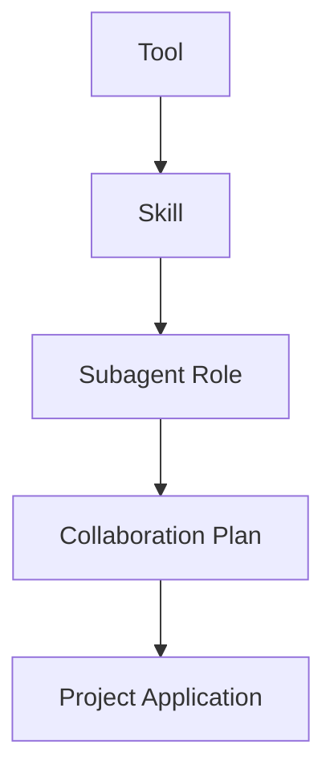
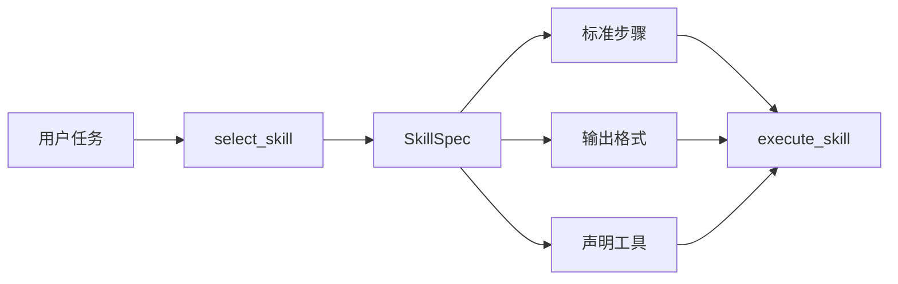
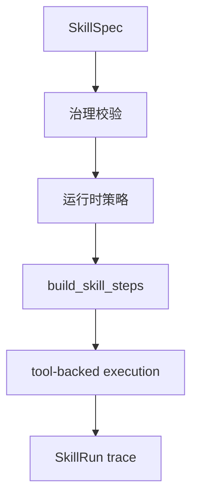
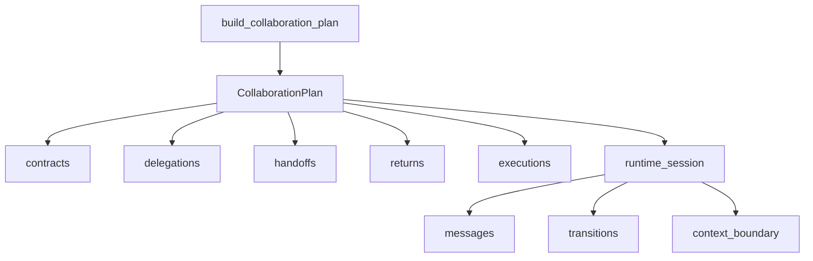

# 第 7 章 能力分层：Skills、Subagent 与角色协作

当系统已经具备状态、工作流、RAG 和 MCP 之后，很多学习者会自然产生一种错觉：既然工具已经能被调用，知识也已经能被检索，协议边界也已经被搭起来，那么 Agent 的主体问题似乎就差不多解决了。可一旦任务继续变复杂，这种判断很快就会被现实打断。因为工具接入解决的只是“系统可以调用什么”，却没有解决“系统应当怎样组织这些能力”。当一个任务同时涉及信息搜集、代码修改、技术解释、风险检查和结果整合时，系统仅仅拥有一组可调用工具，仍然不足以形成稳定协作。它还需要知道哪些动作应该被打包成可复用能力，哪些职责应当由不同角色承担，以及这些角色之间交接时究竟以什么为边界。

这正是 Skills、Subagent 与角色协作进入主线的原因。对一个专业 Agent 系统来说，工具并不是最后一级抽象。工具更像原子动作，真正能够支撑复杂任务复用的，往往是建立在工具之上的能力模板与角色契约。换句话说，系统不能只会“调用一个函数”，它还要学会“按某种专业方法执行一类任务”，并且在必要时把任务拆给不同角色完成。只有这样，系统才会从“能做很多零散动作”走向“能以可解释方式完成一类复杂工作”。

本章讨论的重点，不是构造一个已经完全自主的多智能体系统，而是解释一个更关键的工程阶段：当工具边界已经清楚之后，为什么系统必须继续向上建立能力分层？这个项目在 `v05` 到 `v07` 之间给出的答案，是先用确定性方法建立三层结构。第一层是 Skill，它把若干工具和步骤包装成可以重复使用的任务能力；第二层是 Subagent，它把一类职责固定成角色边界；第三层是协作计划，它把角色之间的委派、交接、回执和状态流转变成正式结构。到了 `v07`，这些结构进一步被收束进项目级应用原型，让前面学到的能力第一次以“学习助手”这种完整产品形态被组合起来。

如果把这一层升级压缩成一张最小关系图，那么本章首先要建立的理解可以看成下面这样：



这张图最重要的地方，不是层数变多，而是每一层都在回答不同问题。Tool 回答“系统具体能做什么动作”；Skill 回答“面对某一类任务，应该如何组织动作”；Subagent 回答“谁来负责哪一段职责”；Collaboration Plan 回答“这些角色如何交接”；Project Application 则回答“这些能力如何在一个完整产品流程里被组合使用”。只要这些问题还被混在一起，系统就很难扩展，也很难解释。

## 从工具到技能：为什么需要 Skill

在没有 Skill 的阶段，系统虽然已经能调用工具，但每次遇到任务时，仍然需要临时决定先做什么、后做什么、最终应该输出什么。这种结构在功能较少时还勉强可以接受，可一旦任务开始重复出现，例如代码评审、学习讲解、资料梳理、书稿排版，系统就会暴露出明显问题。第一，它没有稳定的方法模板；第二，它很难明确说明“这类任务应该怎样做”；第三，它无法把运行时治理前置到能力定义层。工具可以描述动作，却不能单独承担方法论。

项目在 `skills/catalog.py` 中引入 `SkillSpec`，正是为了把“能力模板”从零散工具调用中独立出来。`SkillSpec` 定义的不只是名字，还包括用途、标准步骤、输出格式、版本、来源、路径、别名和显式声明工具。这个结构说明，Skill 在本项目里绝不是 prompt 别名，而是一种具备工程属性的能力条目。它要能被列出、被选择、被治理、被版本化，也要能让读者看清楚：执行这类任务时，系统打算遵循什么步骤，以及哪些工具被允许参与其中。

如果把 Skill 在系统中的作用单独画出来，它大致可以看成这样：



这张图说明，Skill 的职责不是替代工具，而是把工具放进一套可重复的方法结构中。`skills/catalog.py` 中的内置 skill 如 `research_brief`、`code_review` 和 `learning_explanation`，分别对应研究整理、代码评审和学习讲解三类典型任务。系统选择的已经不再是“调用哪个工具”，而是“这次任务更适合哪一种能力模板”。这种变化非常关键，因为它意味着系统开始显式地区分任务类型，而不是在每次执行时都从零拼接动作。

更进一步，当前项目并没有把 Skill 固定死在代码里。`discover_project_skills()` 会从 `.codex/skills/*/SKILL.md` 中发现项目级技能，把书稿工作流、专业代码审查等能力也纳入同一注册表。这样一来，Skill catalog 既包含内置教学能力，也包含项目私有工作流能力。这正是工业化系统常见的形态：一部分能力来自系统内核，另一部分能力来自项目域内沉淀，而它们需要被同一种注册和治理机制统一管理。

## Skill 不是提示词，而是可治理能力

很多团队在早期做 Agent 时，往往会把“skill”理解成一段写得更长的 prompt，或者一个封装得更漂亮的函数名。这样的理解是不够的，因为它忽略了 Skill 最重要的工程价值：Skill 既是方法模板，也是治理对象。项目在 `skills/policy.py` 和 `skills/execution.py` 中把这个问题处理得很明确。一个 Skill 要想真正运行，不仅要能被选中，还要先经过运行时策略检查与治理校验。

`SkillRuntimePolicy` 用来定义在当前运行环境里哪些 skill 可以执行，是否允许 builtin skill，是否允许 project skill，是否存在白名单、黑名单和最低版本要求。`SkillGovernancePolicy` 则把更偏静态的质量要求写成规则，例如 skill 是否显式带版本、是否有用途说明、是否有输出格式、如果会触发 tool step，是否提前声明了对应工具。这样做的意义，是把“能不能运行”和“这个能力定义是否合格”拆成两个层次。前者属于运行时控制，后者属于能力治理。

`execute_skill()` 则把这一整套校验真正放进执行流程：先选择 skill，再构建 step spec，接着做治理验证和策略评估，最后才逐步运行并生成 `SkillRun`。`SkillRun` 里保存了 policy decision、governance validation、audit trail、step result 和 final output，这说明 Skill 执行不是一个黑箱函数返回值，而是一段带痕迹、带解释、可追溯的运行记录。对后续更复杂的系统而言，这种“能力执行留痕”的思路会自然延伸到 registry、permission、release gate 和长期治理中。

如果把 Skill 的治理闭环画出来，它更像下面这样：



这条链路说明，Skill 的本质不是“多了一层包装”，而是系统第一次把任务级能力定义、运行约束和执行记录合并成一套正式结构。也正因为如此，Skill 才能成为连接“工具世界”和“角色世界”的桥梁。工具负责动作，Skill 负责方法，而角色则负责承担方法。

## 从能力模板到角色边界：为什么需要 Subagent

即便 Skill 已经把任务方法模板定义出来，系统仍然还差一层边界。因为一个复杂任务未必只需要一种方法论，也未必适合由同一角色完成。代码修改和代码讲解是两种不同责任；学习规划和工程验证是两种不同责任；资料梳理和最终实现也常常需要不同判断标准。如果系统把这些职责始终放在同一执行身份里，它虽然仍然可以“完成任务”，却很容易在边界上变得含混不清。

这也是项目引入 `subagent/team.py` 的原因。这个模块并没有直接尝试实现开放式多智能体对话，而是先用确定性结构把角色协作的最低边界写清楚。`SubagentSpec` 负责定义角色身份、核心职责、何时交接、允许输入和必须输出；`SubagentTaskContract` 负责定义每次委派的明确目标、输入边界、必需输入、输出边界、预期产物和恢复交接；`SubagentDelegationRecord`、`SubagentHandoffRecord`、`SubagentReturnRecord` 和 `SubagentExecutionRecord` 则分别记录派工、交接、回执和执行证据。

这一设计有一个非常值得强调的取舍：项目先实现的是“角色边界可表达”，而不是“角色真的自由对话”。这是非常专业的做法。因为在大多数系统里，真正导致多 Agent 失控的，往往不是模型能力不够，而是角色关系、输入边界、交付边界和恢复路径没有先被定义清楚。只要这些边界缺失，多 Agent 很快就会退化成几段互相调用却责任不明的 prompt。`subagent/team.py` 的价值，在于它把原本最容易被口头化的协作概念，变成了一组可以被阅读、被测试、被追踪的数据结构。

如果把 Subagent 协作最小化，它大致可以看成下面这样：


这张图说明，Subagent 的核心不是“多一个 agent”，而是“多一层责任边界”。在本项目里，`teacher_agent` 负责解释、规划和学习边界澄清，`coding_agent` 负责实现、修复、测试和工程质量维护。这和仓库中的 `AGENTS.md` 约束、`subagent/README.md` 说明，以及两个默认子代理目录中的职责定义互相对应，形成了一套自洽的角色系统。读者在这里看到的，不只是一个协作 demo，而是一种非常重要的工程原则：角色拆分首先是为了边界清晰，而不是为了显得系统更聪明。

## 协作计划的真正价值：不是对话，而是契约与状态

在很多公开讨论中，多 Agent 常常被想象成多个角色不停对话、互相讨论、再达成一个结果。可从工程角度看，真正应该首先建立的并不是自由对话，而是协作计划与状态流转。本项目在 `CollaborationPlan` 和 `SubagentRuntimeSession` 上所做的事，正是把“协作”从语言想象变成结构对象。`CollaborationPlan` 收集已分配角色、任务契约、委派记录、交接记录、回执记录、执行记录和最终运行会话；`SubagentRuntimeSession` 则进一步保存上下文边界、消息信封和状态迁移。

这样的结构让协作第一次具备了可以被复盘的骨架。系统不再只是说“Teacher Agent 先解释，再由 Coding Agent 实现”，而是能够明确记录：为什么发生交接，交接时带了什么摘要，子任务完成后返回了什么产物，当前会话从什么状态走到了什么状态。对于学习项目来说，这一点尤其重要，因为读者并不只想看到“协作能跑”，更想理解“协作到底由哪些结构组成”。而对于专业系统来说，这种记录又是后续引入 runtime session、checkpoint、replay 和 governance 的先决条件。

如果把协作计划与运行会话的关系进一步画出来，可以得到下面这张图：



这张图表明，协作计划并不是附属输出，而是系统对一次多角色任务的正式建模。也正因为计划和状态已经存在，项目后面才有可能继续走向真正的 runtime foundation。这一点在 `subagent/README.md` 中已经写得很清楚：当前协作计划会输出 delegation record、handoff record、return record、execution record、runtime session、message envelopes 和 state transitions。换句话说，项目虽然还没有走到完全自主的多智能体运行时，但它已经把通向那个方向所需的关键结构预先立了起来。

## 从协作演示到项目应用：v07 为什么重要

如果 `v05` 主要解决的是 Skill catalog 与 Subagent planner 的基础边界，`v06` 主要解决的是 eval 和 trace 护栏，那么 `v07` 的价值在于它第一次把这些能力放进一个完整应用原型中。`agent/project.py` 中的 `ProjectLearningAssistant` 并不是新的基础运行时，而是一个非常有代表性的应用层编排器：它复用 `WorkspaceAgent`，先读 README，再做本地 RAG，再走 MCP，再做 skill 选择，再规划 subagent 协作，最后跑回归评估并输出报告。

这一层对于理解本章非常重要。因为它证明 Skill 和 Subagent 并不是孤立 demo，而是已经能够进入产品流程。`ProjectLearningAssistant.run()` 展示的是一种更成熟的工程方法：底层 `WorkspaceAgent` 继续负责统一路由和执行，应用层对象则负责把多个能力按业务目标组织起来。这样一来，系统既保住了底层主链路的稳定性，又允许上层产品持续扩展。这种“基础 Agent 保持通用，项目应用负责编排”的分层，在真正的工业系统里非常常见。

从学习角度说，`v07` 还提醒读者区分两件常常被混淆的事情。第一，deterministic planning 并不等于真正的多 Agent runtime；第二，deterministic planning 依然是进入真实 runtime 之前必须完成的训练阶段。没有前者的边界建模，后者只会变成难以治理的自由生成。项目在 `v05-v07` 中选择先做确定性协作计划、再做应用层集成，而不是一开始就追求“多个 agent 自主聊天”，正体现了这种成熟判断。

## 这一章在全书中的位置

从全书主线看，第 6 章已经解决了工具如何被协议化接入的问题，而本章解决的是能力如何被分层组织的问题。前者把动作纳入统一边界，后者把方法和角色纳入统一边界。没有第 6 章，能力来源会混乱；没有第 7 章，能力组织会混乱。到了下一章，系统就会自然进入“模型参与决策”这一主题，因为一旦工具、技能和角色边界已经具备，系统下一步要处理的，就是这些结构如何与真正的模型决策循环结合。

因此，本章的意义并不只是多出几个目录或几个数据结构，而是项目第一次明确回答了一个工业级 Agent 必须面对的问题：当系统中已经有很多能力时，应该如何让这些能力以可解释、可治理、可协作的方式存在？本项目给出的答案是，先从 Skill registry 开始，把任务方法变成能力条目；再从 Subagent spec 开始，把角色职责变成明确边界；最后用 Collaboration Plan 和 Runtime Session 把协作过程变成结构对象。这样一来，系统才真正开始从“会调用很多能力”走向“会组织很多能力”。

下一章将进入 tool calling 与 tool loop，继续追问同一个问题在更高动态性下的变化：当系统不再只靠确定性规则选择能力，而是开始让模型参与决策时，执行闭环、能力边界和协作结构会发生什么变化。

## 本章代码入口

- `skills/catalog.py`
  重点看 `SkillSpec`、`get_available_skills()`、`discover_project_skills()` 和 `select_skill()`，理解能力条目如何被注册、发现和选择。
- `skills/policy.py`
  重点看 `SkillRuntimePolicy`、`SkillGovernancePolicy`、`evaluate_skill_runtime_policy()` 和 `validate_skill_governance()`，理解 skill 为什么必须有运行时约束与治理校验。
- `skills/execution.py`
  重点看 `SkillRun`、`SkillStepResult` 和 `execute_skill()`，理解 skill 执行为什么要保留结构化痕迹。
- `subagent/team.py`
  重点看 `SubagentSpec`、`SubagentTaskContract`、`CollaborationPlan`、`SubagentRuntimeSession` 以及协作计划构建函数，理解角色协作如何被显式建模。
- `tests/test_collaboration.py`
  重点看 skill、governance、subagent plan 和 runtime session 的测试，理解这一章的结构不是展示性代码，而是被持续验证的能力。
- `agent/project.py`
  作为承上启下的代码入口，理解 `ProjectLearningAssistant` 如何把 skill 与 subagent 协作纳入应用层编排。

## 代码版本定位

本章建议先切换到章节锚点标签 `book-ch07-anchor`，再以 `v05` 作为首个版本起点，顺着 `v06` 和 `v07` 观察能力如何从“可定义”走向“可验证”和“可集成”。

推荐检出命令：

```bash
git checkout book-ch07-anchor
```

推荐原因：

- `book-ch07-anchor` 已经固定了本章当前对应的稳定代码阅读入口。
- `v05` 最集中地呈现了 skills catalog、subagent planner 和角色协作边界的最小实现。
- `v06` 让这些能力第一次进入 eval 与 trace 护栏。
- `v07` 则把它们纳入项目级学习助手原型，展示应用层编排方式。

推荐阅读顺序：

1. 先读 `versions/v05_skills-subagent-collaboration.md`，建立本章最初的结构背景。
2. 再读 `versions/v06_engineering-evals-observability.md`，理解为什么这些能力需要被验证和留痕。
3. 最后读 `versions/v07_project-learning-assistant.md`，理解它们如何进入综合项目编排。

建议优先阅读代码：

- `skills/catalog.py`
- `skills/policy.py`
- `skills/execution.py`
- `subagent/team.py`
- `tests/test_collaboration.py`
- `agent/project.py`

最小验证命令：

```bash
python -m unittest tests.test_collaboration tests.test_project
python -m cli.collaboration_demo --task "Review this code and add tests."
python -m cli.project_demo
```

## 本章阅读与验证指引

读完本章后，建议按以下顺序继续验证：

1. 先读 `skills/README.md` 和 `subagent/README.md`，建立能力层与角色层的整体图景。
2. 再读 `skills/catalog.py`、`skills/policy.py` 和 `skills/execution.py`，确认 skill 在本项目里为什么不是 prompt 别名，而是可治理能力条目。
3. 再读 `subagent/team.py`，确认角色协作为什么首先表现为契约、记录和状态流转，而不是自由对话。
4. 最后读 `agent/project.py` 与 `tests/test_collaboration.py`，确认这一章的结构如何进入项目级应用与回归验证。

如果你能回答下面四个问题，就说明本章的核心已经建立起来：

1. 为什么工具边界被搭起来之后，系统仍然必须继续建立 skill 和 subagent 两层抽象？
2. 为什么本项目中的 skill 不是“长一点的 prompt”，而是要带版本、步骤、输出格式和声明工具的能力条目？
3. 为什么多角色协作首先应该被建模成契约、委派、交接和状态，而不是多个 agent 的自由聊天？
4. 为什么 `v05-v07` 这组版本虽然还不是真正的多智能体运行时，却依然是走向工业级 Agent 的关键阶段？
